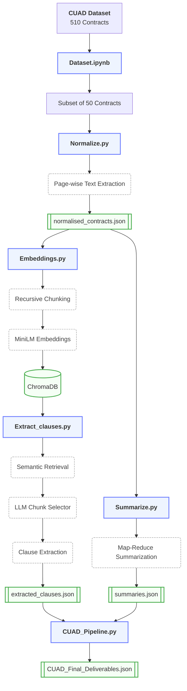

# CUAD - Contract Processing Pipeline using LLM's

## Overview
This is an LLM-powered pipeline that processes a collection of legal contracts using Retrieval-Augmented Generation (RAG) and Large Language Models (LLMs). The system is built to fulfill two primary tasks:

* **Task 1 (Data Loading & Preprocessing):** Involves automated retrieval of a 50-contract subset from the CUAD dataset, followed by preprocessing where the raw PDF contracts are cleaned, normalized, and converted into page-wise JSON structures.
* **Task 2 (Information Extraction & Summarization using LLMs):**
  * **Part A (Clause Extraction):** Identifies and extracts specific legal provisions from each contract using retrieval-augmented extraction (ChromaDB + LLM).
  * **Part B (Contract Summarization):** Generates a concise, context-aware summary of the complete contract.

The pipeline combines semantic search, vector databases and LLM reasoning to accurately extract legal clauses and generate contract summaries.

---
## Architecture & Flow Diagram



## Folder Structure

```text
contracts/
│
├── *.pdf                          # CUAD contract documents
│
├── Dataset.ipynb                  # Downloads and prepares the 50-contract CUAD subset
├── Normalize.py                   # Extracts, cleans, and normalizes PDF text into page-wise JSON
├── Embeddings.py                  # Chunks contracts, generates embeddings, and builds the ChromaDB index
├── Extract_clauses.py             # Retrieves relevant context and extracts legal clauses using LLMs
├── Summarize.py                   # Generates contract summaries using a Map-Reduce pipeline
├── CUAD_Pipeline.py               # Merges extracted clauses and summaries into the final deliverable
│
├── normalised_contracts.json      # Normalized page-wise contract text
├── extracted_clauses.json         # Extracted termination, confidentiality, and liability clauses
├── summaries.json                 # Generated contract summaries
└── CUAD_Final_Deliverables.json   # Final submission containing summaries and extracted clauses
```


## Models & Infrastructure
To guarantee data privacy, ensure zero API latency and bypass cloud provider rate limits, this entire pipeline was engineered to run locally.

- **Provider** : Ollama
- **Model** : llama3.1:8b (Used for both Clause Extraction and Summarization)
- **Embedding Model** : all-MiniLM-L6-v2 (SentenceTransformers)
- **Vector Store** : ChromaDB (Persistent Local Storage)

## Setup & Prerequisites
Before running the pipeline, ensure your local environment is configured:

1. **Local LLM Engine** : Install Ollama and pull the required local model :
```
ollama pull llama3.1:8b
```
2. **Virtual Environment** : Create and activate a Python virtual environment to cleanly isolate dependencies :
```
# On Windows
python -m venv venv
venv\Scripts\activate

# On macOS/Linux
python3 -m venv venv
source venv/bin/activate
```
3. **Python Dependencies** : Install the required libraries from the requirements file :
```
pip install -r requirements.txt
```


## Approach & Instructions to Run

The pipeline should be executed sequentially, as each stage generates the required input artifacts for the subsequent stage.

### Step 1: Data Acquisition (Task 1)
**Approach** : The pipeline begins by fetching a predefined subset of 50 contracts directly from the Hugging Face CUAD dataset. It securely downloads the raw PDFs and places them into a local /contracts directory.

**Command** : Run all cells in the Jupyter Notebook.
```
jupyter notebook Dataset.ipynb
```


