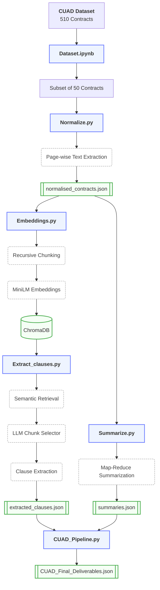

# CUAD - Contract Processing Pipeline using LLM's

## Overview
This is an LLM-powered pipeline that processes a collection of legal contracts using Retrieval-Augmented Generation (RAG) and Large Language Models (LLMs). The system is built to fulfill two primary tasks:

* **Task 1 (Data Loading & Preprocessing):** Involves automated retrieval of a 50-contract subset from the CUAD dataset, followed by preprocessing where the raw PDF contracts are cleaned, normalized, and converted into page-wise JSON structures.
* **Task 2 (Information Extraction & Summarization using LLMs):**
  * **Part A (Clause Extraction):** Identifies and extracts specific legal provisions from each contract using retrieval-augmented extraction (ChromaDB + LLM).
  * **Part B (Contract Summarization):** Generates a concise, context-aware summary of the complete contract.

The pipeline combines semantic search, vector databases and LLM reasoning to accurately extract legal clauses and generate contract summaries.

---
## Architecture & Flow Diagram


---
## Folder Structure

```text
Doc_processor/
│
├── contracts/                     # Folder containing the downloaded PDF documents
│   └── *.pdf                      # 50 CUAD contract PDFs
│
├── CUAD_chroma_db/                # Folder containing the persistent ChromaDB vector store
│
├── Dataset.ipynb                  # Downloads and prepares the 50-contract CUAD subset
├── Normalize.py                   # Extracts, cleans, and normalizes PDF text into page-wise JSON
├── Embeddings.py                  # Chunks contracts, generates embeddings, and builds the ChromaDB index
├── Extract_clauses.py             # Retrieves relevant context and extracts legal clauses using LLMs
├── Summarize.py                   # Generates contract summaries using a Map-Reduce pipeline
├── CUAD_Pipeline.py               # Merges extracted clauses and summaries into the final deliverable
│
├── requirements.txt               # Python dependencies
├── normalised_contracts.json      # Normalized page-wise contract text
├── extracted_clauses.json         # Extracted termination, confidentiality, and liability clauses
├── summaries.json                 # Generated contract summaries
└── CUAD_Final_Deliverables.json   # Final submission containing summaries and extracted clauses

```

---
## Models & Infrastructure
To guarantee data privacy, ensure zero API latency and bypass cloud provider rate limits, this entire pipeline was engineered to run locally.

- **Provider** : Ollama
- **Model** : llama3.1:8b (Used for both Clause Extraction and Summarization)
- **Embedding Model** : all-MiniLM-L6-v2 (SentenceTransformers)
- **Vector Store** : ChromaDB (Persistent Local Storage)

---
## Setup & Prerequisites
Before running the pipeline, ensure your local environment is configured:

1. **Local LLM Engine** : Install Ollama and pull the required local model :
```
ollama pull llama3.1:8b
```
2. **Virtual Environment** : Create and activate a Python virtual environment to cleanly isolate dependencies :
```
# On Windows
python -m venv venv
venv\Scripts\activate

# On macOS/Linux
python3 -m venv venv
source venv/bin/activate
```
3. **Python Dependencies** : Install the required libraries from the requirements file :
```
pip install -r requirements.txt
```

---
## Approach & Instructions to Run

The pipeline should be executed sequentially, as each stage generates the required input artifacts for the subsequent stage.

### Step 1: Data Loading (Task 1)
**Approach** : The pipeline begins by fetching a predefined subset of 50 contracts directly from the Hugging Face CUAD dataset. It securely downloads the raw PDFs and places them into a local `/contracts` directory.

**Command** : Run all cells in the Jupyter Notebook.
```
jupyter notebook Dataset.ipynb
```

### Step 2 : Text Normalization (Task 1) 
**Approach** : Raw PDFs are sampled and normalized. `Normalize.py` extracts text from each PDF using PyMuPDF's block-based extraction `(page.get_text("blocks"))` rather than plain line-by-line extraction. This explicitly preserves true paragraph boundaries instead of flattening every line, which drastically improves downstream chunking quality. Output is saved as `normalised_contracts.json`, containing clean page-level text per contract. 

**Command:**
```
python Normalize.py
```

### Step 3: Vectorization (Task 2) 
**Approach** : Because text volume ranges from ~3K to ~225K characters, processing full contracts directly would overload context limits. The contract text is chunked using a paragraph/sentence-aware `RecursiveCharacterTextSplitter (chunk size: 1500, overlap: 200)`. These are converted to dense vectors using `all-MiniLM-L6-v2` and stored in a persistent local ChromaDB instance, indexed natively by `contract_id`. 

**Command:**
```
python Embeddings.py
```

### Step 4: Clause Extraction (Task 2 - Part A) 

**Approach** : This script implements a retrieval-augmented extraction workflow. For each `clause type (termination, confidentiality, liability)`, the top semantic candidates are retrieved. Rather than issuing a separate API call for every single chunk—which would require 12 costly calls per clause type—the architecture utilizes an `LLM as a Selector` Tool with **Prompt Batching**. The LLM evaluates all candidates simultaneously in a single batched prompt to return the relevant indices. Validated chunks are then sent to the extractor to compile the target clause verbatim. Because many contracts in the dataset genuinely do not contain these specific provisions, the system is strictly instructed to return "Not specified" when a clause is absent, completely eliminating hallucinated extractions. 

**Command:**
```
python Extract_clauses.py
```

**Output:** Saved as `extracted_clauses.json`

```json
{
    "contract_id":"...",
    "termination_clause":"...",
    "confidentiality_clause":"...",
    "liability_clause":"..."
}
```

### Step 5 : Contract Summarization (Task 2 - Part B) 
**Approach** : Summarization requires full-document coverage. Since no single semantic query can accurately isolate the entirety of a contract's core details, RAG-based chunking is inappropriate here. Instead, contracts under a specific context limit are processed directly. Larger contracts are dynamically divided into page-safe groups and summarized via a `Map-Reduce framework`: each group receives concentrated, factual notes (Map step) before a final synthesis step condenses those aggregated notes into a cohesive 100–150 word document summary (Reduce step). 

**Command:**
```
python Summarize.py
```

**Output:** Saved as `summaries.json`
```json
{
    "contract_id":"...",
    "summary": "..."
}
```

## Step 6 : Expected Deliverables 
**Approach :** `CUAD_Pipeline.py` acts as the final aggregator. It runs a deterministic matching join on the intermediate `extracted_clauses.json` and `summaries.json` artifacts using their shared `contract_id` keys, outputting the clean, standardized JSON array required by the assignment evaluation guidelines. 

**Command:**
```
python CUAD_Pipeline.py
```

**Final Output:** saved as `CUAD_Final_Deliverables.json`.
```json
{
    "contract_id":"...",
    "summary": "...",
    "termination_clause":"...",
    "confidentiality_clause":"...",
    "liability_clause":"..."
}
```
---

# Challenges Faced 

During development, semantic retrieval alone proved insufficient for precise legal clause extraction. High embedding similarity occasionally retrieved table-of-contents entries, section headings, or contextually related passages instead of the actual contractual clauses. 

To improve retrieval quality, a cross-encoder reranking stage (BGE Reranker) was evaluated to reorder the retrieved chunks. While it improved semantic ranking, certain legally relevant clauses still received lower relevance scores due to the complexity and verbosity of legal language, leading to missed extractions. 

To address this, the pipeline architecture was adjusted to include the LLM-based chunk selection stage. Rather than relying solely on embedding similarity or reranking scores, the LLM evaluates the retrieved candidate chunks and selects only those that genuinely contain the requested legal clause before extraction. This significantly improved extraction accuracy while reducing false positives and ensuring that the final output preserves the original contractual wording. 

# Author 
Raj Jangam


